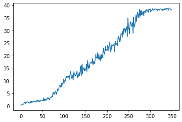

# Hyperparameters
Actor Learning Rate: 0.001, getting multiplied by 0.996 every episode
Critic Learning Rate: 
Update Frequency: Every episode
Actor mini-batch size: 150
Actor batch size: 100
Critic mini-batch size: 200
Critic Batch size: 200, then 50 after first 10 games

# Learning
The agent took 295 episodes to solve the environment(the average reward between 195 and 295 is 30.06). As shown in the graph below, 
the reward took a while to increase, but then continued to rise quickly. As it approached the maximum possible score, the rate at which its reward increased dropped drastically. 
The agent likely would not continue to improve its reward much with continued training time due to the fact that since the episode ends after a set time, it is impossible to 
get a score past the limit of around 40.

